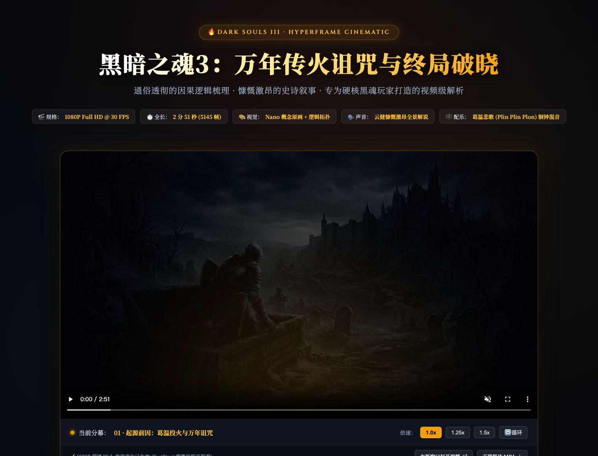

# 黑暗之魂3 · 传火因果与终局

以中文旁白和分幕视频回顾传火循环、薪王与灰烬的终局选择。

A Chinese narrated video exploring the linking of the fire, Lords of Cinder and final choices.

[在线体验](https://dark-souls-3-lore.xiaosang.cc/) · [源码](https://github.com/holynova/dark-souls-3-lore)



## 可以做什么

- 播放器与剧情章节共同呈现故事线索。
- 保留合成时间线、图像、旁白与成片。

## 观看与工程

打开在线页面播放，或选择章节定位观看。包含主线与结局剧透。

[打开成片](https://dark-souls-3-lore.xiaosang.cc/dark_souls_3_lore.mp4) · [仓库中的视频](./dark_souls_3_lore.mp4)

实测成片：1920 × 1080，30 fps，H.264 + AAC；时长 2:51，文件约 17.2 MiB。

`index.html` 是公开播放器；`composition.html` 与 `compositions/` 保留视频合成源码。旁白和配乐在 `assets/`。

## 本地预览

```bash
python3 -m http.server 8080
```

打开 http://localhost:8080/。播放器直接使用仓库成片，无需先渲染。

重新渲染需安装工程依赖和可用的 Chrome；在 HyperFrames 中使用 `composition.html` 合成入口，避免把播放器页面当作视频时间线。

影视化剧情是作者的剪辑与解释，游戏角色、官方素材及相关商标归各自权利人；这是非官方项目。


## 发布

```bash
npx --yes wrangler@4.128.0 deploy --dry-run --config wrangler.jsonc
npx --yes wrangler@4.128.0 deploy --config wrangler.jsonc
```

从 `main` 同一提交在本地手动发布到Cloudflare Workers。正式地址：[https://dark-souls-3-lore.xiaosang.cc/](https://dark-souls-3-lore.xiaosang.cc/)。 `.assetsignore` 限定公开播放器/站点资源，排除合成工程、开发文件与未供页面使用的大体积音频/字体。
